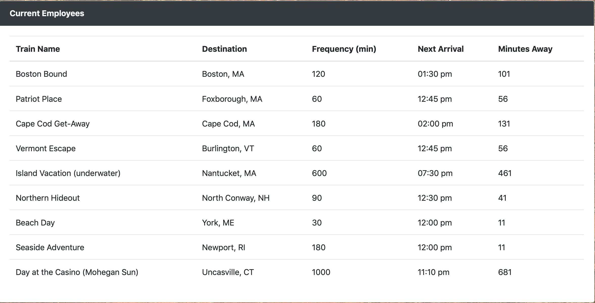

# TrainSchedule

The Train schedule app is a train schedule that is constantly updating by pulling data from firebase, and calculating details about the train like what time the next train is arriving as well as how many minutes until arrival. It also allows you to manually add a new train to the schedule, which also adds the data to the firebase database. 

The train schedule is where the train times are constantly updating. The next arrival and minutes until arrival are udpating by the minute on refresh so you always know when the next train is set to arrive. 